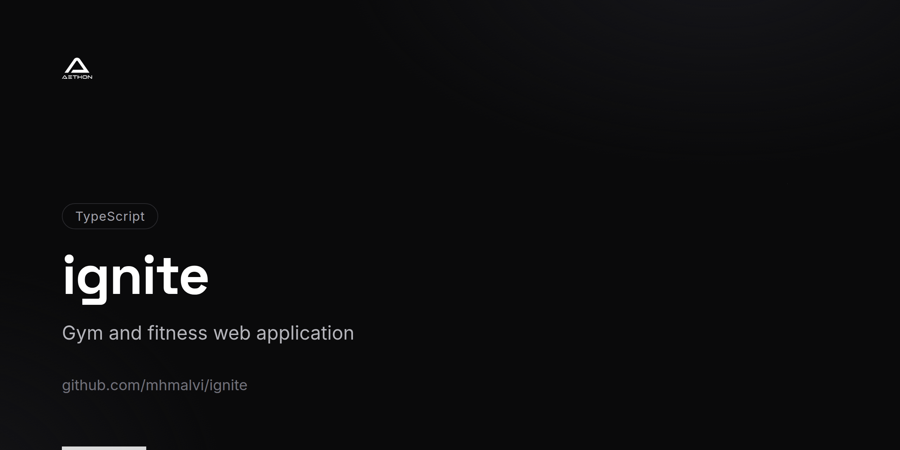

<!-- repo-card -->


<div align="center">

# Ignite

A bold, high-energy gym and fitness web application that lets users explore classes, discover trainers, browse upcoming events, book sessions, and choose membership plans — all within a striking dark-themed interface.


</div>

---

## Features

- **Dynamic Landing Page** — Gradient-rich hero section with animated elements and clear calls to action
- **Classes** — Browse fitness class categories, view detailed class cards, check weekly schedules, and read testimonials
- **Trainers** — Filter trainers by specialty, view stats and certifications, and read client reviews
- **Events** — Discover upcoming fitness events, workshops, and challenges with event cards
- **Booking System** — Seamlessly book classes and sessions through a dedicated booking page
- **Membership Plans** — Compare and select membership tiers with detailed pricing cards
- **Authentication** — Login and sign-up pages with form validation (React Hook Form + Zod)
- **Responsive Navigation** — Sticky header with mobile sheet menu for smaller screens
- **Loading & Error States** — Dedicated loading skeletons and error boundaries for classes and trainers
- **Dark Theme** — Fully dark UI with fire-inspired gradient accents (red, orange, yellow)

## Tech Stack

| Layer | Technology |
|---|---|
| **Framework** | Next.js 15 (App Router) |
| **Language** | TypeScript 5 |
| **Styling** | Tailwind CSS, tailwindcss-animate, @tailwindcss/forms |
| **UI Components** | shadcn/ui, Radix UI (Accordion, Dialog, Label, Slot) |
| **Forms** | React Hook Form, @hookform/resolvers, Zod |
| **Icons** | Lucide React |

## Getting Started

### Prerequisites

- **Node.js** 18+
- **npm**, **yarn**, or **pnpm**

### Installation

1. **Clone the repository**

   ```bash
   git clone https://github.com/mhmalvi/ignite.git
   cd ignite/ignite
   ```

2. **Install dependencies**

   ```bash
   npm install
   ```

3. **Start the development server**

   ```bash
   npm run dev
   ```

   The app will be available at `http://localhost:3000`.

### Build for Production

```bash
npm run build
npm start
```

## Project Structure

```
ignite/
├── app/
│   ├── (auth)/              # Authentication routes
│   │   ├── login/           # Login page
│   │   └── signup/          # Sign-up page
│   ├── (routes)/            # Main application routes
│   │   ├── booking/         # Session booking page
│   │   ├── classes/         # Classes listing with loading/error states
│   │   ├── events/          # Events listing
│   │   ├── membership/      # Membership plans and pricing
│   │   └── trainers/        # Trainers directory with filtering
│   ├── layout.tsx           # Root layout
│   └── page.tsx             # Landing page
├── components/
│   ├── classes/             # Class cards, categories, schedule, testimonials
│   ├── events/              # Event cards
│   ├── layout/              # Navigation, footer, mobile menu
│   ├── membership/          # Pricing cards
│   ├── sections/            # Shared hero and CTA sections
│   ├── trainers/            # Trainer cards, filters, stats, testimonials
│   └── ui/                  # shadcn/ui component library
├── lib/                     # Data utilities (classes, events, membership, trainers)
└── public/images/           # Static assets
```

## License

This project is open source and available under the [MIT License](LICENSE).
